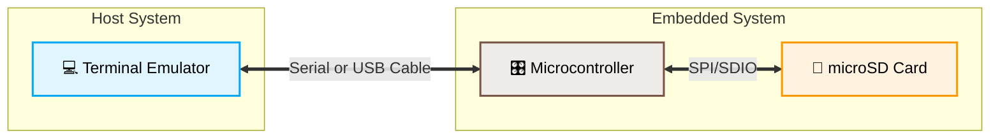

# LiteForth

Cheap MCUs are now as powerful the full-fledged computers of the 1990s.
The value proposition of Forth cross compilers came and went.
Applications are now better-developed within the target MCU.
A typical setup includes:



For development without MCU hardware, LiteForth can
run in a terminal window, with `getchar()` replacing the UART input.
Line Feed (0Ah) means process the line.


The architecture of LiteForth is based on C, allowing it to be extended with
C-based functions where speed is needed. Token threading is used to minimize
code size, so more functionality can be packed into the small MCU environment.

## Code size reduction

Mecrisp Stellaris compiles `: min  2dup > if swap else drop then ;` to about 40 bytes
of native RISC V code. I didn't bother to define `>`, so I gave LiteForth this:
```
: min  
   2dup - -if drop drop exit 
   then drop swap drop 
;

see min                                                                              
01AE 8420  over over                                                                    
01AF 001D  1D call      -                                                               
01B0 6C02  2 -if                                                                        
01B1 D6B0  drop drop ;                                                                  
01B2 D78B  drop swap drop ;                                                             
```
That is a 75\% reduction in code size.

Half is due to using 16-bit tokens rather than 32-bit instructions
and another half is because of MISC-like instructions.

## Data size reduction

Cells are 32-bit. That is a lot of bits. The gods of the Linear Address Space
wanted 64 bits, but that is ignored here. There are no 64-bit MCUs.

32 bits are a lot more than you need to address memory in a simulated CPU.
22 bits work fine. `@` and `!` test the upper 10 bits of the address to determine
whether to use the whole cell or just a bit field.
Bit fields support variables smaller than 32-bit as long as the address fits into
a 5:5:22 format, where the fields are size:shift:address.
This use of bit fields gets rid of the proliferation of data types and their operators.
Having to remember that an 8-bit variable can only be used with `c@` and `c!` is an
invitation for subtle bugs. Let's just not have that.

For example, a variable `x` whose value is between 0 and 10 is declared with
`4 bits x`. `5 x !` stores 5 to x, where `x @` reads it back out.
The `variable` keyword is equivalant to `32 bits`.

`char+` and `chars` manipulate the shift and address fields to support chars of any
width, from 1 to 16 bits. `@` and `!` will work with any width.
For compatibility with ANS Forth, `c@` and `c!` are aliases of `@` and `!`.

## Unified address space

Code and data addresses start at 0. Memory is 32-bit, cell-addressed.
To execute 16-bit code from this 32-bit memory, instructions are packed into pairs.
The address is (PC >> 1) and the data for `inst` is right-shifted by 16 if the LSB of PC is 1.

# ISA

All instructions are 16-bit.
If more data is needed, a `prefix` instruction pre-loads a register for it.
A token interpreter, written in either C or assembly, simulates a MISC CPU.
The code could run on a real CPU defined in Verilog, but here it is simulated.
The ISA should be friendly to both environments.

On RISC V (RV32), the simulator would be much faster in assembly than C since
its internal state can use the callee-saved registers (s1–s11).
Stacks are a power-of-2 deep and keep the top of the stack in a register.
Stack memory would be 2KB-aligned to allow simple bit masking to wrap the stacks
to protect other memory.

The ISA splits into *micro* and *other*.

| *Name* | *15* | *14* | *13:9* | *8:4* | *3:0* |
| :----- | ---- | ---- |------- |------ |------ |
| micro  | 1    | ;    | µop 0  | µop 1 | µop 2 |

| *Name* | *15:13* | *12:0* |
| :----- | ------- | ------ |
| call | 000  | 13-bit address, push PC to return stack   |
| jump | 001  | 13-bit address |
| lit  | 010  | 13-bit literal (push onto data stack) |
| imm  | 011  | 4-bit opcode, 9-bit immediate data |

In simulation, this would be decoded by `if` statements.
Assuming the common case is the `if` clause:
```C
if (inst & 0x8000) {
    // Execute a group of 5-bit MISC instructions
} else {
    if (!(inst & 0x4000)) {
        // Load PC with prefix:inst[12:0] and clear prefix
        if (!(inst & 0x2000)) {
            // Push PC to the return stack
        }
    } else {
        if (!(inst & 0x2000)) {
            // Push prefix:inst[12:0] to the data stack and clear prefix
        } else {
            // Execute a specialized instruction using 16-way jump
        }
    }
}
```
In hardware (FPGA, ASIC), synchronous code memory would be addressed by the PC.
The instruction arrives two clock cycles after PC changes.
When `;` is '1', the instruction bus settles while the group is executing.
The unified address space means that instruction pairs would be registered in `inst32`.
For a synchronous read, `inst32` gets registered right on time.
Two instruction groups typically execute in sequence, with `inst32` being right-shifted
by 16 bits after the first instruction group executes.
Random data memory access would just insert a couple of wait states to get the instruction back on the bus.

*other* instructions that take input from `inst32` settle quickly, not having to wait for decode.

The µops (note - they don't take immediate data) are:

| \\  | *0*   | *1* | *2*  | *3* | *4* | *5* | *6* | *7*  |
| --- | ---   | --- | ---  | --- | --- | --- | --- | ---  | 
| *0* | nop   | inv | over | a!  | +   | xor | and | drop |  
| *1* | swap  | 2\* | dup  | cy! | @a  | @a+ | @b  | @b+  |  
| *2* | 2/c   | 2/  |      | u!  | !a  | !a+ | !b  | !b+  |  
| *3* | unext |     | >r   | u   | cy  | a   | r@  | r>   |

- cy = carry caused by addition or shift
- u = general purpose register
- a, b = address registers for memory
- @ and ! support bit fields: auto-increment handles bit fields

## Imm instructions

| *Name* | *12:9* | *8:0* |
|:-------|---:|:-------------------------------|
| pfx    |  0 | Prefix: lex \= (lex\<\<9) + u9 |
| zoo    |  1 | Other instruction selected by u9 |
| zif    |  2 | PC \= PC \+ s9 if T=0 |
| if     |  3 | PC \= PC \+ s9 if T=0, drop T |
| rcall  |  4 | PC \= PC \+ s9, push PC to return stack |
| bran   |  5 | PC \= PC \+ s9 |
| \-if   |  6 | PC \= PC \+ s9 if T \>= 0 |
| next   |  7 | PC \= PC \+ s9 if R \> 0 else drop R |
| ax     |  8 | A \= X \+ u9 |
| ay     |  9 | A \= Y \+ u9 |
| qlit   | 13 | Push Y \+ u9 |
| RFcall | 14 | Call root function in VM, no stack change |
| AFcall | 15 | Call app function in VM, no stack change |

The lex register supplies upper bits for literals and long calls/jumps.
It is 19 bits wide. N `pfx` instructions add 9N bits to the usual 13-bit `imm` data.
A 22-bit literal, jump, or call takes two instructions.

Zoo instructions push the stack if `imm[8]`=1, and pop the stack if `imm[7]`=1.
They include:

| *Name* | *6:0* | Action |
|:-------|:------|:-------|
| x\!   | 0 | X \= T, drop T |
| y\!   | 1 | Y \= T, drop T |
| throw | 2 | VM quits and returns ior \= T, or sets PC = 2 |
| x\@   | 3 | T \= X |
| y\@   | 4 | T \= Y |
| depth | 5 | T \= depth |

Root functions and App functions are useful when the ISA is simulated.
C functions for eliminating hot spots are accessed through two execution tables.
One set of functions lives in immutable root-of-trust memory.
The other lives in updatable application memory.

## Stacks

For simulation, the stacks are power-of-2 deep, plus one register for the
top of the return stack and two for the top of the data stack.

## How fast is it?

As a preliminary estimate, the execution rate on a CH32H417 (RV32) at 400 MHz
should be 15 to 30 MIPS.
