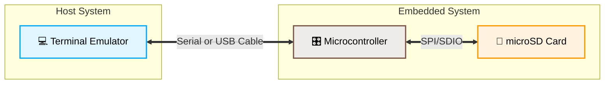
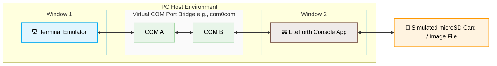

# LiteForth

Cheap MCUs are now as powerful the full-fledged computers of the 1990s.
The value proposition of Forth cross compilers came and went.
Applications are now better-developed within the target MCU.
A typical setup includes:

For development without MCU hardware, a LiteForth instance can
run in a terminal window, with a UART-to-terminal bridge utility
(or just a terminal emulator) running in another window.
The two windows are interconnected by a virtual COM port such as com0com.

The architecture of LiteForth is based on C, allowing it to be extended with
C-based functions where speed is needed. Token threading is used to minimize
code size, so more functionality can be packed into the small MCU environment.
The token interpreter also acts as a sandbox, providing better security than native code.

A key feature of LiteForth is a Root of Trust (RoT) architecture.
Once a trusted application is in place, it is made permanent by digitally signing it.
The immutable RoT section checks the signature after every hard reset ensure
the code has not changed.
While Flash in a locked down MCU is very hard to tamper,
signing covers yet-unknown side-channel attacks.
