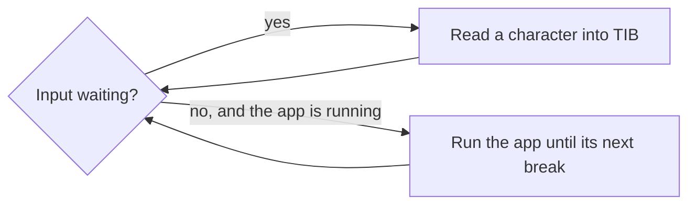

# Flash memory in LiteForth

There are `RAM-PAGE` flash pages, `FLASH_PAGE_CELLS * 4` bytes each, in the system.

`open-flash` *( addr -- )* opens the flash page associated with *addr* by making it writable.
Writes are to a temporary cache buffer.

`close-flash` *( -- )* closes the current flash page by flashing and write-protecting it.

## Physical flash allocation

Supposing a Flash page is `M` flash sectors long, with `FLASH_PAGE_CELLS` set to match,
Flash memory sectors in an MCU are allocated as follows:

| Sector | Usage                                                |
|:-------|:-----------------------------------------------------|
| 0      | Boot loader and LiteForth, N write-protected sectors |
| N      | Security data: HMAC, revision, etc.
| N + 1  | Flash page 0 |
| N + M + 1  | Flash page 1 |
| N + 2 \*M + 1  | Flash page 2 |
| N + 3 \*M + 1  | Flash page 3 |

The boot loader is responsible for checking the Flash signature, or otherwise guaranteeing
that the application is safe to launch.
The first cell in page 0 contains the address of the startup code.
This address is compiled before page 0 is closed, so a multi-page application would put
startup code in the last compiled page at a pre-arranged address.
The app's startup code sets up *idata* and dictionary links.

## Terminal task

By default, the VM is stopped. It only runs when the terminal interprets input.
If there is an error, the VM quits with an error code, which makes it out to the terminal.

While the terminal task waits for keyboard input, it can also run the application.
`cold` resets the VM and sets `SYS_OPTION_RUNNING`. From then on, whenever no input
is waiting, `loadTIB` runs the VM from its PC (`vmRun` in step mode) until the app
executes `break`, then checks the terminal again:



So the app is a macroloop that calls `break` regularly, like the demo in `go.f`:

```forth
:noname ( demo application )
    hi
    begin  demo-step  break
    again
; hex 80000000 ,jump decimal
```

`,jump` compiles a jump to it at code address 0, where `cold` starts the VM.
Because the app only runs between `break`s while the terminal is idle, the terminal
and the app never run at the same time, and handing off control needs no shared variable.

Errors are handled according to who called the VM:

- Interpreting: QUIT runs words through `lfInterpret`, so an error propagates back
to `lfQuit`, which displays an error message.

- Running the app: if the app fails (an error or `yeet`), the VM (stepping, so
`steps` is nonzero) saves the PC in X
and the error code in Y and sets the PC to the yeet handler at cell 2
(`VM_YEET_ADDRESS`, code address 4), whose jump `go.f` installs. The app keeps running from there: it handles its own errors,
as it would on a Forth chip, so it could eventually run its own QUIT loop with no
API calls. A yeet handler is installed like the app's entry point:

```forth
:noname ( yeet handler: y@ = error code, x@ = PC after the fault )
    cr ." App error " y@ .  ." at " x@ hex . decimal cr
    begin  break  again         ( park the app until the next `cold` )
; hex 80000002 ,jump decimal
```

This is the handler in `go.f`: it reports the error and parks the app.

- Timeout: if the app runs `VM_STEP_LIMIT` steps without a `break`, it is stuck,
so `loadTIB` stops it by clearing `SYS_OPTION_RUNNING` and returns `ERR_VM_TIMEOUT`,
which QUIT displays. `cold` starts it again.
