# Flash memory in LiteForth

There are `RAM-PAGE` flash pages, `FLASH_PAGE_CELLS * 4` bytes each, in the system.

`open-flash` *( addr -- )* opens the flash page associated with *addr* by making it writable.
Writes are to a temporary cache buffer.

`close-flash` *( -- )* closes the current flash page by flashing and write-protecting it.

## Physical flash allocation

Supposing a Flash page is `M` flash sectors long, with `FLASH_PAGE_CELLS` set to match,
Flash memory sectors in an MCU are allocated as follows:

| Sector | Usage                                                |
|:-------|:-----------------------------------------------------|
| 0      | Boot loader and LiteForth, N write-protected sectors |
| N      | Security data: HMAC, revision, etc.
| N + 1  | Flash page 0 |
| N + M + 1  | Flash page 1 |
| N + 2 \*M + 1  | Flash page 2 |
| N + 3 \*M + 1  | Flash page 3 |

The boot loader is responsible for checking the Flash signature, or otherwise guaranteeing
that the application is safe to launch.
The first cell in page 0 contains the address of the startup code.
This address is compiled before page 0 is closed, so a multi-page application would put
startup code in the last compiled page at a pre-arranged address.
The app's startup code sets up *idata* and dictionary links.

## Terminal task

By default, the VM is stopped. It only runs when the terminal interprets input.
If there is an error, the VM quits with an error code, which makes it out to the terminal.

While the terminal task is waiting for keyboard input, it can either spin or step the VM through the code.
If `TIBSTATE` = 0, it is stopped. Otherwise, it is running.
Errors returned by the VM are handled differently in each case:

- Stopped: The QUIT loop calls VM, so the return value propagates back through `lfInterpret`
to `lfQuit`, which displays an error message.

- Running: The keyboard input spin loop steps the VM using `vmRun`, igloring the return value.
When the VM sees an error, is sets the PC to 2 and loads B with the ior.
Forth code will handle the error.

Forth and C coexist by sharing a `TIBSTATE` mutex.

- Once `loadTIB` has an input line, it sets `TIBSTATE` to 2 and waits for it to reach 3.
- The Forth macroloop sees `TIBSTATE` at 2 and bumps it to 3. It spins until `TIBSTATE` is 1.
- `loadTIB` sees `TIBSTATE` at 3 and un-pauses, allowing TIB evaluation.
- QUIT invokes `loadTIB`, which initially sets `TIBSTATE` to 1.
- If no Forth code is running, set `TIBSTATE` = 0. `loadTIB` will bypass the handshake.

This scheme expects the Forth app to run a macroloop that includes this FSM.

```mermaid
stateDiagram-v2
    direction LR

    state "TIBstate = 1" as S1
    state "TIBstate = 2" as S2
    state "TIBstate = 3" as S3

    note left of S1
        <b>Terminal Task Owns</b>
        Prepares TIB data
    end note

    note right of S2
        <b>App Task Owns</b>
        Processes TIB data
    end note

    note right of S3
        <b>Terminal Task Owns</b>
        Post-processes TIB
    end note

    S1 --> S2 : Terminal sets to 2
    S2 --> S3 : App sets to 3
    S3 --> S1 : Terminal sets to 1
```

